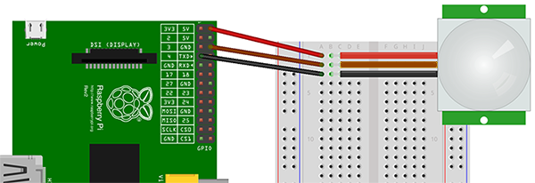

# PIR-monitor for Raspberry Pi

Sample code for using a PIR-sensor with the Raspberry Pi.

# Hardware setup

The PIR-sensor we are using ([SEN-08630](http://littlebirdelectronics.com/products/pir-motion-sensor)) has 3 wires. Red wire is power (5 to 12V). Brown wire is GND. Black wire is open collector alarm. _N.B. Check your sensors data sheet before connecting it your Pi, incorrect wiring could cause damage to your hardware._

Connect your power and ground wires to the respective GPIO pins and your alarm wire to pin 4.



# Software setup

This sample program is using the [bcm2835](http://www.airspayce.com/mikem/bcm2835/) C library to access the GPIO pins. First of all, download the library and install it on your Pi.

Finally, build and run the PIR-monitor sample program:

```
git clone git@github.com:neilang/pir-monitor.git
cd pir-monitor
make
sudo ./pir-monitor
```


# Contributors

* [Neil Ang](https://github.com/neilang)
* [Val Lyashov](https://github.com/vly)
* [Yuan Yang](https://github.com/AlfredYang1986)
